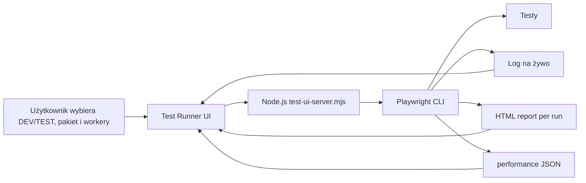
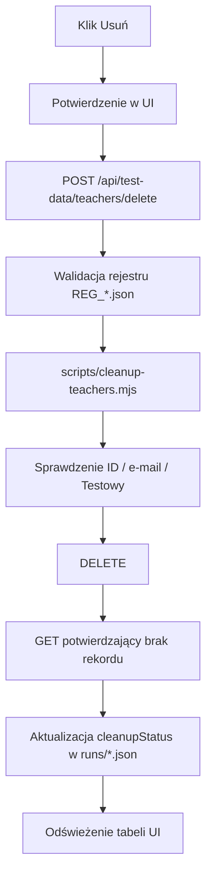

# Octopus Test Runner UI

Lokalny panel do uruchamiania testów Playwrighta, przeglądania raportów oraz podglądu danych utworzonych przez testy bez ręcznego wpisywania komend w PowerShellu.

## 1. Uruchomienie

W katalogu głównym projektu:

```powershell
npm run test-ui
```

Domyślny adres:

```text
http://127.0.0.1:4173
```

Po zmianie plików UI:

```powershell
Ctrl+C
npm run test-ui
```

Następnie w przeglądarce:

```text
Ctrl+F5
```

## 2. Co umożliwia panel

- wybór środowiska DEV / TEST,
- wybór pakietu testów,
- 1 / 2 / 4 workery dla zwykłych pakietów,
- 1 / 2 workery dla Zamówień,
- headed / headless,
- uruchamianie testu po ID lub `grep`,
- wybór pojedynczych testów checkboxami,
- Start / Stop,
- log Playwrighta na żywo,
- liczniki `Passed`, `Expected failed`, `Failed`, `Skipped`,
- ponowne uruchomienie wyłącznie faktycznie nieudanych testów,
- osobny raport HTML dla każdego przebiegu,
- raport wydajności,
- historię ostatnich uruchomień,
- osobny workflow `MED-YEAR-*`,
- podgląd nauczycieli i szkół zapisanych w `runs/*.json`,
- otwieranie nauczyciela lub szkoły bezpośrednio w Octopusie,
- bezpieczne usuwanie nauczycieli testowych z DEV,
- zbiorcze usuwanie zaznaczonych nauczycieli.

## 3. Graficzna mapa UI

```text
┌──────────────────────────────────────────────────────────────────────────────┐
│ OCTOPUS TEST RUNNER                                         [ RUNNING ]      │
├──────────────────────────────────────────────────────────────────────────────┤
│ URUCHOM TESTY                                                                 │
│ Środowisko: [ DEV ▼ ]      Workery: [ 2 ▼ ]                                 │
│                                                                              │
│ [Cała regresja] [Nauczyciele] [Szkoły] [Zamówienia] [Klub] [Medalowość]    │
│ Grep / ID: [ ORD-43____________________________ ]    ☐ Headed               │
│                                                                              │
│ [ ▶ Uruchom testy ] [ ■ Stop ] [ ↻ Ponów failed ]                           │
├──────────────────────────────────────────────────────────────────────────────┤
│ STATUS                                                        10:42          │
│                                                                              │
│ Passed        Expected failed        Failed        Skipped                   │
│   66                 1                  0              0                      │
│                                                                              │
│ [ Otwórz raport HTML ] [ Raport wydajności ]                                │
├──────────────────────────────────────────────────────────────────────────────┤
│ LISTA TESTÓW                                                                 │
│ [ szukaj po ID / nazwie / pliku... ]                                        │
│ ☐ ORD-01 ...                                                                │
│ ☑ ORD-43 ...                                                                │
├──────────────────────────────────────────────────────────────────────────────┤
│ DANE TESTOWE                                                                 │
│ [ Nauczyciele 12 ] [ Szkoły 28 ]                         [ Odśwież ]        │
│                                                                              │
│ Nauczyciele:                                                                │
│ ☐ 534195  REG_...  FAIL  KEPT_FAILED_TEST    [Otwórz] [Usuń]               │
│ ☐ 534201  REG_...  PASS  PENDING_SUITE_END   [Otwórz] [Usuń]               │
│                                            [ Usuń zaznaczonych ]             │
│                                                                              │
│ Szkoły:                                                                      │
│ 93968  REG_... Szkoła testowa            [Otwórz]                           │
│ 93969  AUTO_ORD_REFERENCE_DEV_W0          [Otwórz]                           │
├──────────────────────────────────────────────────────────────────────────────┤
│ LOG NA ŻYWO                                                                 │
│ UI: npx playwright test ...                                                  │
│ ok 1 [chromium] ...                                                          │
├──────────────────────────────────────────────────────────────────────────────┤
│ HISTORIA                                                                     │
│ DEV · Zamówienia      PASSED · 66/66 · expected fail: 1        [Raport]    │
└──────────────────────────────────────────────────────────────────────────────┘
```

## 4. Jak UI uruchamia testy



Przepływ techniczny:

```text
Przeglądarka :4173
       │
       │ POST /api/run
       ▼
test-ui-server.mjs
       │
       │ node <playwright-cli> test ...
       ▼
Playwright
   ├── stdout/stderr ───────────────► log na żywo
   ├── runs/html-reports/<run-id>/ ─► Raport HTML
   └── runs/performance-*.json ─────► Raport wydajności
```

## 5. Dane testowe — nauczyciele i szkoły

Sekcja **Dane testowe** nie odpytuje całej bazy Octopusa. Czyta wyłącznie lokalne rejestry projektu:

```text
runs/REG_<timestamp>_<suffix>.json
```

Dzięki temu pokazuje rekordy, które testy same zapisały do swoich rejestrów diagnostycznych.

### Nauczyciele

Widok pokazuje m.in.:

- ID nauczyciela,
- nazwisko / identyfikator `REG_*`,
- e-mail,
- środowisko,
- nazwę testu,
- wynik testu,
- `cleanupStatus`,
- przycisk **Otwórz**,
- przycisk **Usuń**, jeżeli rekord spełnia warunki bezpiecznego cleanupu.

Można również zaznaczyć kilka rekordów i użyć:

```text
Usuń zaznaczonych
```

### Szkoły

Widok pokazuje szkoły zapisane w rejestrach testów, w tym również szkoły referencyjne używane przez ORD.

Dla szkół dostępny jest tylko:

```text
Otwórz
```

Nie ma przycisku **Usuń**, ponieważ projekt nie ma obsługiwanego endpointu usuwania szkół.

## 6. Bezpieczeństwo usuwania nauczycieli

UI nie wykonuje własnego uproszczonego DELETE.

Po kliknięciu **Usuń** serwer UI uruchamia istniejący mechanizm:

```text
scripts/cleanup-teachers.mjs
```

z konkretną nazwą rejestru `REG_*.json`.

Przed rzeczywistym DELETE cleanup ponownie sprawdza m.in.:

1. format ID nauczyciela,
2. identyfikator rejestru `REG_*`,
3. testowy e-mail `@example.invalid`,
4. zgodność danych z aktualnym rekordem w Octopusie,
5. flagę `Testowy`,
6. wynik testu,
7. stan po wykonaniu DELETE.

Usuwanie z panelu jest obecnie dostępne wyłącznie dla **DEV**.

Jeżeli trwa aktywny przebieg testów, cleanup z UI jest blokowany. Dzięki temu ręczne sprzątanie nie koliduje z aktualnie wykonywanymi scenariuszami.

### Przepływ usuwania



## 7. Workery

### Zamówienia

Pakiet `Zamówienia` obsługuje 1 lub 2 workery.

Przy dwóch workerach każdy worker powinien korzystać z osobnej szkoły referencyjnej:

```text
Worker 0 → AUTO_ORD_REFERENCE_DEV_W0
Worker 1 → AUTO_ORD_REFERENCE_DEV_W1
```

UI blokuje wartość `4` dla tego pakietu.

### Pozostałe pakiety

Dostępne są:

```text
1 / 2 / 4
```

Roczna medalowość zawsze działa na jednym workerze.

## 8. Passed / Expected failed / Failed

Playwright może oznaczyć test przez `test.fail()`.

Przykład:

```ts
test.fail(true, "Znany bug...");
```

Jeżeli taki test faktycznie się wywali, wynik jest oczekiwany i Playwright nie traktuje całego runu jako failed.

UI rozróżnia:

```text
Passed          = wynik Playwrighta; obejmuje również expected failures
Expected failed = informacja, ile testów z Passed zakończyło się zgodnie z test.fail()
Failed          = tylko prawdziwe, nieoczekiwane failures
Skipped         = pominięte testy
```

Dlatego:

```text
Passed: 66
Expected failed: 1
Failed: 0
```

oznacza **66/66 zaliczonych testów**, z czego jeden jest znanym błędem kontrolowanym przez `test.fail()`.

Expected failure nie trafia do przycisku **Ponów failed**.

## 9. Ponów failed

Panel zapisuje ID wyłącznie rzeczywistych failures wypisanych przez końcowe podsumowanie Playwrighta.

Przycisk:

```text
↻ Ponów failed
```

uruchamia tylko te przypadki.

## 10. Raporty HTML per run

Każdy przebieg zapisuje własny raport:

```text
runs/
└── html-reports/
    ├── <run-id-1>/index.html
    ├── <run-id-2>/index.html
    └── <run-id-3>/index.html
```

Dzięki temu uruchomienie pojedynczego testu nie nadpisuje raportu wcześniejszej pełnej regresji.

## 11. Historia

Historia jest zapisywana w:

```text
runs/test-ui-history.json
```

Przykład:

```text
25.09.2026 13:58   DEV · Zamówienia   PASSED · 66/66 · expected fail: 1
25.09.2026 13:50   DEV · Zamówienia   FAILED · 1/4
```

## 12. Lista testów

Lista jest pobierana z Playwrighta przez odpowiednik:

```powershell
npx playwright test --list
```

Można wyszukiwać po ID, nazwie lub pliku oraz zaznaczać konkretne przypadki.

## 13. Roczna medalowość

`MED-YEAR-PREP` i `MED-YEAR-01` są oddzielnym workflow.

Panel:

- wymaga potwierdzenia,
- uruchamia je na jednym workerze,
- ustawia `OCTOPUS_INCLUDE_ANNUAL=1`,
- nie dodaje ich do zwykłej regresji.

## 14. Endpointy lokalnego UI

Najważniejsze endpointy serwera lokalnego:

```text
GET  /api/status
GET  /api/tests
POST /api/run
POST /api/stop
GET  /api/history
GET  /api/test-data
POST /api/test-data/teachers/delete
GET  /api/performance/latest
POST /api/rerun-failed
GET  /report/<run-id>/
```

## 15. Pliki UI

```text
scripts/test-ui-server.mjs
test-ui/index.html
test-ui/app.js
test-ui/styles.css
TEST-UI.md
```

Usuwanie nauczycieli wykorzystuje istniejący plik projektu:

```text
scripts/cleanup-teachers.mjs
```

Nie trzeba go zmieniać tylko po to, aby korzystać z przycisku **Usuń** w panelu.
